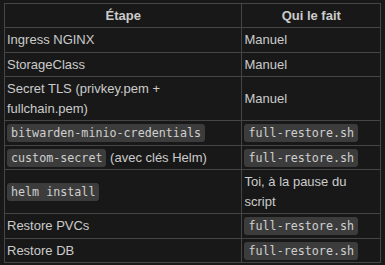
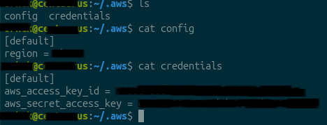

# Déploiement de Bitwarden Self-Hosted sur Kubernetes

Ce document décrit le déploiement de Bitwarden self-hosted sur un cluster Kubernetes à l'aide de Helm, avec :

- **Ingress NGINX** (HTTP 8080 / HTTPS 4444)
- **Stockage persistant** via `local-path-provisioner`
- **Secrets Kubernetes** pour la configuration sensible

---

## Prérequis

- Cluster Kubernetes fonctionnel
- `kubectl` configuré
- `helm` installé
- Accès administrateur au cluster
- Certificats TLS (`tls.crt` et `tls.key`)
- Fichier `values.preprod.yaml` prêt pour Bitwarden

---

## 1. Déploiement de l'Ingress NGINX

### Création du namespace

```bash
kubectl create namespace ingress-nginx
```

### Déploiement de l'Ingress Controller

```bash
kubectl apply -f ~/bitwarden_helm/ingress_nginx/ingress-nginx.yaml
```

### Vérification du démarrage

```bash
kubectl wait --namespace ingress-nginx \
  --for=condition=ready pod \
  --selector=app.kubernetes.io/component=controller \
  --timeout=60s
```

---

## 2. Gestion des StorageClass et des volumes gérer par Rancher 

### Création du provisionner pour alimenter les PVCs
```bash
kubectl apply -f https://raw.githubusercontent.com/rancher/local-path-provisioner/v0.0.24/deploy/local-path-storage.yaml
```

### Vérification de la StorageClass
```bash
kubectl get storageclass
```

### Supprimer le StorageClass en mode delete 
```bash
kubectl delete storageclass local-path
```

### Pour les supprimer 
```bash
kubectl delete storageclass <NAME>
```

### Pour voir tout les PVCs
```bash 
kubectl get pvc -n bitwarden
```

### Si on utilise minio pour le stockage S3 pour faire des tests : 
```yaml
services:
  minio:
    image: minio/minio:RELEASE.2025-01-20T14-49-07Z
    container_name: minio
    command: server /data --console-address ":9001"
    ports:
      - "9000:9000"   # API S3
      - "127.0.0.1:9001:9001"   # Console web
    environment:
      MINIO_ROOT_USER: minioadmin
      MINIO_ROOT_PASSWORD: minioadmin
    volumes:
      - minio-data:/data
    restart: unless-stopped

volumes:
  minio-data:
```
Voici un exemple de docker compose que l'on peut utilise pour minio. 
Mais en plus de cela il nous faut récupérer notre acces key et secret key de minio donc une fois que nous avons lancer minio il suffit de aller dans le menu a gauche dans Acces Keys et en crée une nouvelles.
Comme on peut le voir les fichiers dans backup_bitwarden ce sont eux qui vont nous aider a faire les backups de bitwarden et c'est restore. 
Donc on vas légérement modifier les fichier .sh pour intégré le faites qu'il faut aller sauvegarder les backups sur Minio et aller les chercher sur minio. 

Ou allons-nous stockée donc c'est deux clef acces key et secret key. 
Dans un secret Kubernetes : 
```bash 
kubectl create secret generic bitwarden-minio-credentials \
  --namespace bitwarden \
  --from-literal=accessKey=TON_ACCESS_KEY \
  --from-literal=secretKey=TON_SECRET_KEY
```
A garder c'est très important les clef de minio.

Donc, si vous utilisez par exemple OVH pour votre stockage S3, il faudra légèrement adapter le secret Kub pour qu'il puisse être reconnu par le système quand il se fera appeler. 

Il faudra le crée de cette manière : 
```bash 
kubectl create secret generic bitwarden-s3-credentials -n bitwarden \
  --from-literal=accessKey="<TON_ACCESS_KEY_OVH>" \
  --from-literal=secretKey="<TON_SECRET_KEY_OVH>"
```
Pour le coup, le projet a été fait pour fonctionner avec un stockage S3 de chez OVH, c'est celui que j'ai utilisé pour faire mes tests. 
Après, il suffit juste de modifier tous les fichiers dans backup_bitwarden pour qu'ils aillent pointer sur Minio. 

---

## 5. Création du namespace Bitwarden

```bash
kubectl create namespace bitwarden
```

---

## 6. Création des secrets Bitwarden

Les informations sensibles sont stockées dans un secret Kubernetes.

```bash
kubectl create secret generic custom-secret -n bitwarden \
  --from-literal=globalSettings__installation__id="" \
  --from-literal=globalSettings__installation__key="" \
  --from-literal=globalSettings__mail__smtp__username="" \
  --from-literal=globalSettings__mail__smtp__password="" \
  --from-literal=globalSettings__yubico__clientId="dummy" \
  --from-literal=globalSettings__yubico__key="dummy" \
  --from-literal=globalSettings__hibpApiKey="dummy" \
  --from-literal=SA_PASSWORD="" \
  --from-literal=adminSettings__admins=""
```

### Description des variables importantes

| Variable | Description |
|---|---|
|`globalSettings__installation__id` | https://bitwarden.com/fr-fr/host/ |
|`globalSettings__installation__key` | https://bitwarden.com/fr-fr/host/ |
|`globalSettings__mail__smtp__username` | Adresse mail qui envoie les mails de créeation de compte etc ... |
|`globalSettings__mail__smtp__password` | Mot de passe application de l'adresse mail | 
| `SA_PASSWORD` | Mot de passe du compte SQL Server utilisé par Bitwarden |
| `adminSettings__admins` | Adresse(s) email(s) des comptes administrateurs Bitwarden |


### Vérification du secret

```bash
kubectl get secret -n bitwarden
```

---

## 7. Création du secret TLS

Les certificats TLS sont nécessaires pour l'accès HTTPS.
```bash 
openssl req -x509 -nodes -days 365 -newkey ec \
  -pkeyopt ec_paramgen_curve:P-256 \
  -keyout privkey.pem \
  -out fullchain.pem \
  -subj "/CN=192.168.10.139.nip.io"
```
```bash
kubectl create secret tls tls-secret \
  --key privkey.pem \
  --cert fullchain.pem \
  -n bitwarden
```

## 8. Création du secret de chiffrement des backups 
```bash 
kubectl create secret generic bitwarden-gpg-public-key \
  --from-file=public.asc=/tmp/public.asc \
  -n bitwarden
```
---

## 9. Déploiement de Bitwarden avec Helm

```bash
helm install bitwarden ./bitwarden_helm/self-host \
  --namespace bitwarden \
  --values bitwarden_helm/self-host/values.preprod.yaml \
  --timeout 10m
```
Il ne faut pas oublier de lancer le CronJob dans ```backup_bitwarden/database-backup/backup-cronjob.yaml```

---

## 10. Suppression de Bitwarden

### Désinstallation Helm

```bash
helm uninstall bitwarden -n bitwarden
```

### Suppression des namespaces

```bash
kubectl delete namespace bitwarden
kubectl delete namespace local-path-storage
kubectl delete namespace ingress-nginx
```

## 11. Déchiffrement des backups : 
### Clef GPG : 
Clef public = chiffrement 
Clef priver = déchiffrement
Il faut donc vérifier que vous avez la bonne clef de chiffrement sur le nodes qui a bitwarden: 
```bash
gpg --list-keys 
```
Il faut aussi vérifier que nous avons la bonne clef de déchiffrement sur nodes qui a bitwarden :
```bash
gpg --list-secret-keys
``` 
#### Exemple de sortie pour clef public : 
```bash 
victor@kube:~/bitwarden_helm/partage_nfs$ gpg --list-key
/home/victor/.gnupg/pubring.kbx
-------------------------------
pub   ed25519 2026-02-25 [SC]
      A0D9F405586AC6EE76E85CDB70169E6628FB20FC
uid           [ultimate] Bitwarden Backup <questmk320@tuta.io>
sub   cv25519 2026-02-25 [E]
```
#### Exemple de sortie pour clef priver: 
```bash 
orktk@centaurus:~/victor/minio$ gpg --list-secret-keys
/home/orktk/.gnupg/pubring.kbx
------------------------------
sec   rsa4096 2025-10-01 [SC]
      FE9E26892B7CCA1A58E934871DC9CFA13D696195
uid          [  ultime ] HelmDeployment
ssb   rsa4096 2025-10-01 [E]

sec   ed25519 2026-02-26 [SC]
      CFB496BA6800650BE44D53FE6D5A26A37A68EA1B
uid          [  ultime ] Bitwarden Backup
ssb   cv25519 2026-02-26 [E]
```
---

```bash
 gpg --decrypt vault_XXXXXXXX.bak.gpg > vault_restored.bak
```

Donc la dans cette partie nous parlons de chiffrement. Comme nous allons l'utiliser pour les backups de bitwarden. 
Donc il faudra générer une paire de clef comme celle montrais en exemple, avec une pass phrase. 
Comme sur chaque serveur nous aurons kubectl de configurer 

## 12. Les backups et comment en faire et comment les réinjecter :

### Faire une backup : 

Donc rien de plus simple il faut aller exécuter ce fichier .sh 

```bash bitwarden_helm/backup_bitwarden/database-backup/db-backup.sh```. 

### Faire une restoration de la backup dans un nouveau bitwarden : 


Comme on peut le voir sur la photo on peut comprendre ce qui est gérer par nous ou par le script.

#### Etape 1 — Simuler le sinistre (désinstaller Bitwarden)

```bash 
helm uninstall bitwarden -n bitwarden
```
Puis vérifie que tout est bien parti :

```bash 
kubectl get pods -n bitwarden
```

#### Etape 2 — Lancer le full-restore
```bash 
bash backup_bitwarden/database-restore/full-restore.sh
```
Il va te demander les identifiants MinIO et l'endroit où se situe la clef privée qui va avec la clef publique qui a chiffré le backup, puis faire une pause pour que tu relances helm install manuellement sur un autre terminal. Une fois helm install et terminé, il faudra revenir sur l'ancien terminal pour appuyer sur entrée.

#### Etape 3 — Vérifier
Une fois tout terminé, connecte-toi sur l'interface Bitwarden et vérifie que ton compte est bien là.

## 13. Commande AWS S3 
### Comment voir le nombre de backup dans le S3 
```bash
aws s3 ls "s3://database-repairsoft/backup_bitwarden/" --endpoint-url "https://s3.rbx.io.cloud.ovh.net" --recursive --human-readable --summarize
```
A condition de bien avoir remplie le : 

